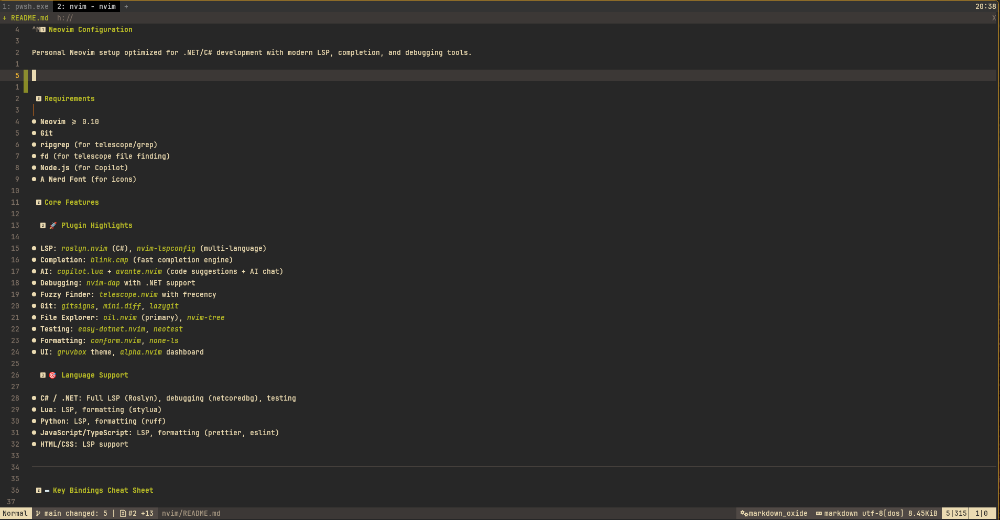


# Neovim Configuration

Personal Neovim setup optimized for .NET/C# development with modern LSP, completion, and debugging tools.




## Requirements

- **Neovim** >= 0.10
- **Git**
- **ripgrep** (for telescope/grep)
- **fd** (for telescope file finding)
- **Node.js** (for Copilot)
- **A Nerd Font** (for icons)

## Core Features

### 🚀 Plugin Highlights

- **LSP**: `roslyn.nvim` (C#), `nvim-lspconfig` (multi-language)
- **Completion**: `blink.cmp` (fast completion engine)
- **AI**: `copilot.lua` + `avante.nvim` (code suggestions + AI chat)
- **Debugging**: `nvim-dap` with .NET support
- **Fuzzy Finder**: `telescope.nvim` with frecency
- **Git**: `gitsigns`, `mini.diff`, `lazygit`
- **File Explorer**: `oil.nvim` (primary), `nvim-tree`
- **Testing**: `easy-dotnet.nvim`, `neotest`
- **Formatting**: `conform.nvim`, `none-ls`
- **UI**: `gruvbox` theme, `alpha.nvim` dashboard

### 🎯 Language Support

- **C# / .NET**: Full LSP (Roslyn), debugging (netcoredbg), testing
- **Lua**: LSP, formatting (stylua)
- **Python**: LSP, formatting (ruff)
- **JavaScript/TypeScript**: LSP, formatting (prettier, eslint)
- **HTML/CSS**: LSP support

---

## ⌨️ Key Bindings Cheat Sheet

**Leader key**: `Space`

### General

| Key | Action | Context |
|-----|--------|---------|
| `;` | Enter command mode | Normal |
| `jk` | Exit insert mode | Insert |
| `<leader><leader>` | Previous buffer | Normal |
| `<C-n>` | Toggle nvim-tree | Normal |
| `<leader>e` | Focus nvim-tree | Normal |
| `<leader>o` | Open Oil (file manager) | Normal |

### LSP & Code

| Key | Action |
|-----|--------|
| `gD` | Go to declaration |
| `gd` | Go to definition |
| `gi` | Go to implementation |
| `gy` | Go to type definition |
| `gr` | Show references |
| `K` / `<C-k>` | Hover documentation |
| `<C-.>` | Code actions |
| `<leader>ra` | Rename symbol |
| `<leader>ds` | Diagnostic loclist |
| `<leader>fm` | Format file/selection |
| `<leader>tih` | Toggle inlay hints |
| `gp` | Go to previous (remapped `[`) |
| `gn` | Go to next (remapped `]`) |

### Telescope (Fuzzy Finder)

| Key | Action |
|-----|--------|
| `<leader>fa` | Find all files (seeker) |
| `<leader>ff` | Find git files (seeker) |
| `<leader>fw` | Live grep (seeker) |
| `<leader>fp` | Recent files (frecency) |
| `<leader>fb` | Buffers |
| `<leader>fh` | Help tags |
| `<leader>fk` | Keymaps |
| `<leader>fo` | Old files |
| `<leader>fz` | Current buffer fuzzy find |
| `<leader>cm` | Git commits |
| `<leader>gt` | Git status |
| `<leader>fc` | Find in config |
| `<leader>fl` | Find in lazy plugins |

### Git

| Key | Action |
|-----|--------|
| `<leader>gg` | Open LazyGit |
| `<leader>gc` | LazyGit current file |
| `<leader>gd` | Toggle git diff overlay |
| `<leader>gn` | Next git hunk |
| `<leader>gr` | Reset hunk |
| `<leader>gl` | Blame line |
| `<leader>gb` | Full file blame |

### Testing & .NET (C# files only)

| Key | Action |
|-----|--------|
| `<leader>tr` | Run test (from buffer or selected) |
| `<leader>ta` | Run all tests from buffer |
| `<leader>tR` | Run all tests (test runner) |
| `<leader>td` | Debug test |
| `<leader>tp` | Peek stack trace |
| `<leader>tf` | Filter failed tests |
| `<C-p>` | Run .NET project |

### HTTP/REST (.http files only)

| Key | Action |
|-----|--------|
| `<leader>R` | Run HTTP request |
| `<leader>Rr` | Replay last request |
| `<leader>Rc` | Copy as cURL |
| `<leader>Rt` | Toggle view |
| `[r` / `]r` | Navigate requests |

### Debugging (DAP)

| Key | Action |
|-----|--------|
| `<F5>` | Continue / Start debugging |
| `<F6>` | Debug test with DAP |
| `<F10>` | Step over |
| `<F11>` | Step into |
| `<S-F11>` | Step out |
| `<S-F5>` | Terminate debug session |
| `<F9>` | Toggle breakpoint |
| `<leader>dr` | Open REPL |
| `<leader>dl` | Run last debug session |
| `<leader>dt` | Terminate DAP |
| `<leader>dv` | Evaluate expression |

### Navigation & Motion

| Key | Action |
|-----|--------|
| `s` | Flash jump (quick motion) |
| `S` | Flash treesitter jump |
| `<C-d>` / `<C-u>` | Half-page down/up |
| `<leader>q` | Toggle quickfix |
| `<leader>l` | Toggle loclist |

### Terminal

| Key | Action |
|-----|--------|
| `<C-g>` | Toggle terminal |
| `<C-x>` | Exit terminal mode (in terminal) |
| `<Esc><Esc>` | Exit terminal mode (alternative) |

### Comments

| Key | Action |
|-----|--------|
| `<leader>/` | Toggle comment (line/selection) |
| `gcc` | Toggle line comment |
| `gc` | Comment selection (visual) |

### AI Tools

| Key | Action |
|-----|--------|
| `<C-w>` | Accept Copilot suggestion |
| `<C-d>` | Dismiss Copilot |
| `<leader>aa` | Ask Avante (AI chat) |
| `<leader>ae` | Edit with Avante |
| `<leader>ar` | Refresh Avante |

### Which-Key

| Key | Action |
|-----|--------|
| `<leader>wK` | Show all keymaps |
| `<leader>wk` | Query specific keymap |

---

## 🔧 Configuration Structure

```
nvim/
├── init.lua              # Entry point, lazy.nvim bootstrap
├── lua/
│   ├── options.lua       # Vim options & settings
│   ├── mappings.lua      # Global key mappings
│   ├── autocmds.lua      # Autocommands
│   └── plugins/          # Plugin configurations
│       ├── lsp.lua       # LSP, treesitter, roslyn, easy-dotnet
│       ├── completions.lua   # blink.cmp, snippets
│       ├── debugging.lua     # DAP, neotest
│       ├── telescope.lua     # Fuzzy finder
│       ├── git-tools.lua     # Git integrations
│       ├── ai-tools.lua      # Copilot, Avante
│       ├── kulala.lua        # HTTP client
│       └── ...               # Other plugin configs
└── lazy-lock.json        # Plugin version lock
```

## 🎨 Customization

- **Change theme**: Edit `lua/plugins/init.lua` and modify the gruvbox config
- **Add LSP servers**: Edit `lua/plugins/lsp.lua` in the lspconfig section
- **Modify keybindings**: Edit `lua/mappings.lua` for global, or plugin files for plugin-specific
- **Add plugins**: Create new file in `lua/plugins/` that returns a lazy.nvim spec

## 🐛 Troubleshooting

**LSP not working?**
```vim
:LspInfo          " Check attached servers
:Mason            " Install missing LSP servers
```

**Plugins not loading?**
```vim
:Lazy sync        " Update all plugins
:Lazy clean       " Remove unused plugins
```

**Performance issues?**
```vim
:Lazy profile     " Check plugin load times
```

**Treesitter error: `Invalid node type "except*"` (tai vastaava) Python-tiedostoa avattaessa?**

Tämä johtuu siitä, että Neovim pitää vanhaa parseria lukossa, joten `:TSUpdate python` ei pysty ylikirjoittamaan sitä. Sulje Neovim ja kopioi kompilloitu parseri manuaalisesti:

```powershell
Copy-Item -Force "$env:LOCALAPPDATA\nvim-data\tree-sitter-python\parser.so" `
                 "$env:LOCALAPPDATA\nvim-data\lazy\nvim-treesitter\parser\python.so"
```

Avaa Neovim uudelleen — virheen pitäisi olla poissa.

## 📝 Notes

- **Swap files disabled** to avoid Windows Defender issues
- **CursorHold** used for LSP highlight (not CursorMoved) for performance
- **Filetype-specific keybindings** prevent conflicts (e.g., `<leader>R` works differently in .http vs .cs files)
- **updatetime** set to 250ms for responsive feedback

---

## 🔗 Useful Commands

| Command | Description |
|---------|-------------|
| `:Lazy` | Open plugin manager |
| `:Mason` | Open LSP/tool installer |
| `:TSUpdate` | Update treesitter parsers |
| `:Telescope` | Open telescope picker |
| `:DotnetUI` | Open .NET project UI |
| `:LspRestart` | Restart LSP servers |
| `:MessagesToBuffer` | Copy messages to new buffer |

## License

Personal configuration - feel free to use/modify as needed.


# Tips and tricks 

## Norm 
### Lisää jotain sanan loppuun kaikilla riveillä

```vim
:%norm A;
```
Lisää ; jokaisen rivin loppuun.

### Lähetä esc painallus

(^[ = ESC, helpoin tapa on <C-v><Esc>)

Jos halutaan ajaa vain tietyille:

```vim

```


## s - substitute

:[range]s[ubstitute]/{pattern}/{string}/[flags] [count]

esim.

```vim
:%s/vanhateksti/uusiteksti/g
```
-> vaihtaa kaikki vanhateeksti esiintymät uusiteksti 

```vim
'<,'>s/vaihtaa/uusiteksti/gc
```
-> tekee valitulle alueelle, kysyy jokaisen esiintymisen kohdalla


```vim
'<,'>s./.%.g

```

-> Erottimena voi käyttää muitakin kuin / merkkiä, tässä erottimena . koska / vaihdetaan % merkiksi.

